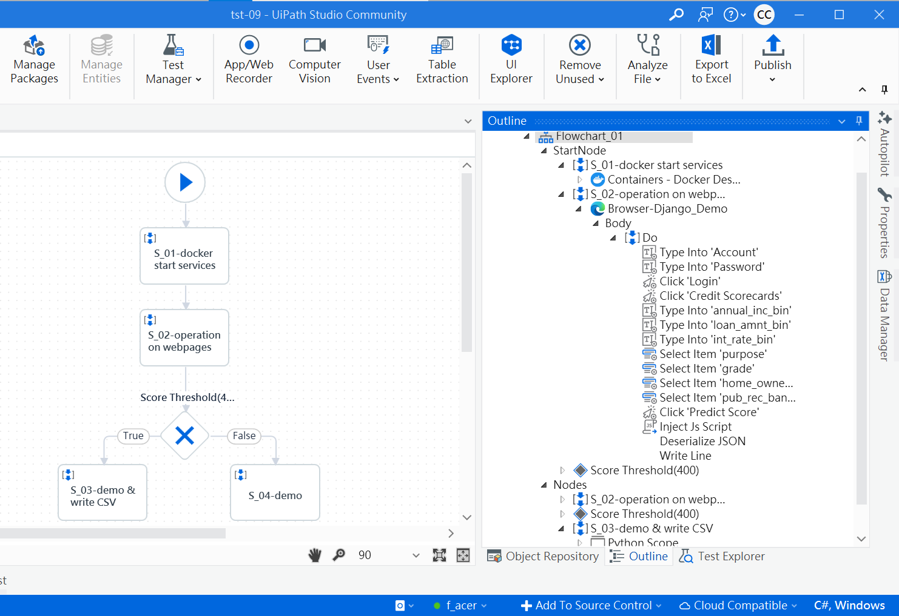

# **uipath_demo_01**

## **RPA: a simple example of integrating JavaScript and Python with UiPath for Web Automation**

#### **Ⅰ. 目的** 
研調 RPA (Robotic Process Automation)，實作UiPath來操作網頁，並在其流程(Process)中使用JavaScript擷取內容再由Python處理資料。此外，發佈(Publish)於 UiPath Orchestrator Cloud 設定時間遠端自動執行。 

#### **Ⅱ. 主要工具**
UiPath Studio Desktop、UiPath Orchestrator Cloud、JavaScript、Python

#### **Ⅲ. 說明**
1.流程架構 

在UiPath Studio開啓Process，創建1個Flowchart，其中新增3個Sequence，於之間建立1個Flow Decision，如【圖01】左側所示，Sequence中的Activity如【圖01】右側的Outline所示。其內容說如下： 

(1)第1個Sequence「S_01 - operation on webpages」主要使用「Use Application/Browser」、「inject Js Script」。第2、3個Sequence「S_02 - demo & write CSV」、「S_03 - demo」僅用「Python Scope」。 

(2)第1個Sequence「S_01 - operation on webpages」執行結果交由Flow Decision「Score Threshold」，其中之一指標超過門檻值400則執行「S_02 - demo & write CSV」，否則執行「S_03 - demo」。 

【 圖01：UiPath Studio - 建立Process 】 
  

2.流程步驟 

(1)第1個Sequence「S_01 - operation on webpages」 
UiPath開啟瀏覽器(Microsoft Edge)，到一個網站( 詳見 [專案django_demo_01](<https://github.com/qinglian1105>) ) ，接著輸入帳密登入進入首頁後，於左側side menu點選「信用評分預測(Credit Scorecards)」選單，即進入主要目標頁面如【圖02】所示，填完Form的 7 個變數資料，按「Predict Score」鍵後，將於下方以藍色文字及儀表盤呈現預測結果(分數、評級)，由JavaScript程式擷取輸入資料及預測結果，門檻值即預測結果的分數(score)。 

【 圖02：主要操作及擷取資料的頁面 】
  

(2)第2個Sequence「S_02 - demo & write CSV」 
門檻值超過400，則執行本Sequence，Python程式將處理編輯內容及寫入CSV檔，然後返回予Message Box顯示如【圖03】所示，按「確定」後關閉網頁，完成整個Process自動化。 

【 圖03：Process執行最後畫面 - 高於門檻值 】
  

(3)第3個Sequence「S_03 - demo」
未達門檻值，則執行本Sequence，同樣由Python程式將處理編輯內容，但不執行寫入CSV檔，然後返回予Message Box顯示如【圖04】所示，按「確定」後關閉網頁，完成整個Process自動化。
 

【 圖04：Process執行最後畫面 - 低於門檻值 】
  

建構本Process之相關檔案，詳見UiPath流程主檔「Main.xaml」、程式檔「demo_injectJS.js」、「processing_msg.py」及資料產出檔「predict_report.csv」。  

以上，一個簡單Web Automation例子展現UiPath與JavaScript、Python整合。  

3.Orchestrator Cloud操作 

(1)將Process發佈(Publish)到 Orchestrator Cloud後，設定Time Trigger，名稱為「tst-09_cron_02」，選擇Account、Machine、Hostname，並直接以Cron格式設定執行時間，如【圖05】所示。 

【 圖05：Orchestrator Cloud - Time Triggers畫面 】 
  

(2)等待所設定時間開始執行「tst-09」這個 Process，最近一次執行Job的資訊如【圖06】紅框所示，其中Source是 Time Trigger名稱，State是 Successful，代表此Job已於1分鐘前成功執行。 

【 圖06：Orchestrator Cloud - Jobs畫面 】 
  

另外，畫面中可見為使用 MacOS電腦，登入 Orchestrator Cloud作觸發設定，待設定時間來臨將自動於另一台電腦 Windows 10上( 如上述【圖03】及【圖04】)，依序完成Process各個步驟。 

綜上所述，Process發佈於 UiPath Orchestrator Cloud 設定時間遠端自動執行。
  

---

#### **References**

[1] [RPA教室](<https://www.youtube.com/@RPA-Class>)

[2] [Gartner 魔力象限報告 2024 RPA 市場現況與主要供應商分析](<https://aiworks.tw/gartner-magic-quadrant-2024/>)

[3] [UiPath Inc.](<https://www.uipath.com/>)

[4] [PGi 樺鼎商業資訊 - uipath](<https://www.perform-global.com/product/uipath>)

[5] [UiPath中文教學](<https://www.youtube.com/watch?v=IL4lsZX9LqI&list=PLBHK5akT2cACpRygEIjbpZtLF50bjrdep&index=2>)

[6] [UiPath Documentation](<https://docs.uipath.com/activities/other/latest/developer/python-scope>)

[7] [UiPath: Orchestrator User Guide](<https://docs.uipath.com/orchestrator/automation-cloud/latest/user-guide/introduction>)