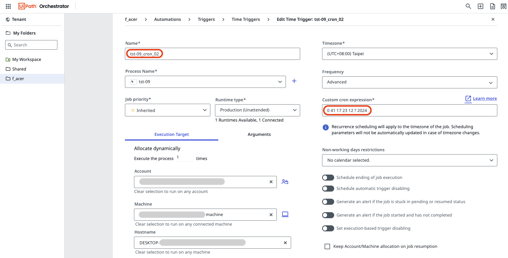

# **uipath_demo_01**

## **A simple example of integrating Python and JavaScript With UiPath for web automation**

#### **Ⅰ. 目的** 
研調 RPA (Robotic Process Automation)，實作UiPath來操作網頁，並在其流程中使用JavaScript擷取內容再由Python處理資料。 
此外，使用「Publish」功能，發佈於 UiPath Orchestrator Cloud 定時執行。 

#### **Ⅱ. 主要工具**
UiPath Studio Desktop、UiPath Orchestrator Cloud、JavaScript、Python

#### **Ⅲ. 說明**
1. 架構： 
在UiPath Studio開啓Process，創建一個Flowchart，其中新增一個Sequence，Sequence加入「Use Application/Browser」、「inject Js Script」及「Python Scope」。 
2. Process主要步驟： 
開啟瀏覽器(Microsoft Edge)，到一個網站( 專案django_demo_01 [詳見](<https://github.com/qinglian1105>)) ，接著輸入帳密登入，於左側side menu點選某一選單，在Form填入資料按鍵執行，由JavaScript程式擷取輸入資料及預測結果，再由Python程式編輯內容及寫入CSV檔，然後返回予Message Box顯示，按「確定」後關閉網頁，完成整個Process自動化，詳見檔案 「Main.xaml」、「demo_injectJS.js」、「processing_msg.py」、「predict_report.csv」。部份頁面及說明如下：   
【 UiPath Studio - 建立Process 】 
Sequence中的Activity如下右邊的Outline所示，可見紅底線為「inject Js Script」及「Python Scope」。 
  
【 啓動Process - 執行到最後步驟的頁面 】 
UiPath執行至此頁面時(選單-信用評分預測)，填完Form的 7 個變數資料，按「Predict Score」鍵後，將於下方以藍色文字及儀表盤呈現結果，UiPath安排JavaScript擷取輸入資料及藍色文字存成變數，給予Python程式編輯內容及寫至CSV檔後，再返回予Message Box顯示內容如下圖所示，按「確定」後關閉網頁以完成整個Process自動化過程。 
 
以上，一個簡單Web Automation例子展現UiPath與JavaScript、Python整合。  
3. Orchestrator Cloud操作： 
【 Orchestrator Cloud - Time Triggers畫面 】 
將Process發佈(Publish)到 Orchestrator Cloud後，設定Time Trigger，名稱為「tst-09_cron_02」，選擇Account、Machine、Hostname，並直接以Cron格式設定執行時間，如下所示： 
  
【 Orchestrator Cloud - Jobs畫面 】 
等待所設定時間開始執行「tst-09」這個Process ，最近一次執行Job的資訊如下圖紅框所示，其state是 Successful。 
 
另外，畫面中可見為使用 MacOS電腦，登入 Orchestrator Cloud作觸發設定，待設定時間來臨將自動於另一台電腦 Windows 10 上 (如上述【 啓動Process - 執行到最後步驟的頁面 】)，依序完成Process各個步驟。  

---

#### **References**

[1] [RPA教室](<https://www.youtube.com/@RPA-Class>)

[2] [UiPath Inc.](<https://www.uipath.com/>)

[3] [PGi 樺鼎商業資訊 - uipath](<https://www.perform-global.com/product/uipath>)

[4] [UiPath中文教學](<https://www.youtube.com/watch?v=IL4lsZX9LqI&list=PLBHK5akT2cACpRygEIjbpZtLF50bjrdep&index=2>)

[5] [UiPath Documentation](<https://docs.uipath.com/activities/other/latest/developer/python-scope>)

[6] [UiPath: Orchestrator User Guide](<https://docs.uipath.com/orchestrator/automation-cloud/latest/user-guide/introduction>)