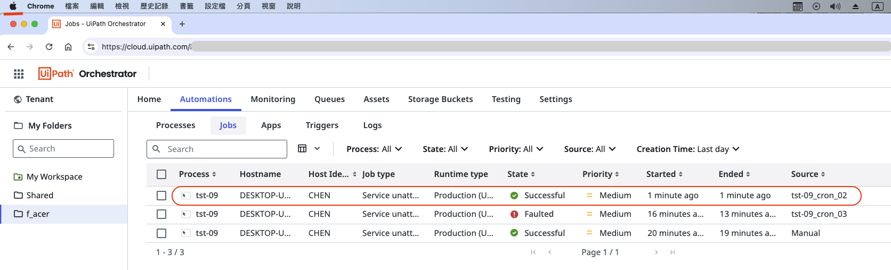

# **uipath_demo_01**

## **A simple example of integrating Python With UiPath for web automation**

#### **Ⅰ. 目的** 
研調 RPA (Robotic Process Automation)，實作UiPath來操作網頁，並在其流程中使用Python處理資料。 
此外，使用「Publish」功能，發佈於 UiPath Orchestrator Cloud 定時執行。 

#### **Ⅱ. 主要工具**
UiPath Studio Desktop、UiPath Orchestrator Cloud、Python

#### **Ⅲ. 說明**
1. 架構： 
在UiPath Studio開啓Process，創建一個Flowchart，其中新增一個Sequence，Sequence加入Python Scope。 
2. Process主要步驟： 
開啟瀏覽器(Microsoft Edge)，到一個網站( 專案django_demo_01 [詳見](<https://github.com/qinglian1105>)) ，接著輸入帳密登入，於左側side menu點選某一選單，在Form填入資料按鍵執行，將結果存成變數，該變數再由Python程式處理後，返回予Message Box顯示，按「確定」後關閉網頁，完成整個Process自動化，詳見檔案Main.xaml。部份頁面及說明如下：   
【 UiPath Studio - 建立Process 】 
Sequence中的Activity如下右邊的Outline所示。 
  
【 啓動Process - 執行到最後步驟的頁面 】 
UiPath執行至此頁面時(選單-信用評分預測)，填完Form的 7 個變數資料，按「Predict Score」鍵後，將於下方以藍色文字及儀表盤呈現結果，UiPath將擷取藍色文字存成變數，給予Python程式(詳見檔案processing_msg.py)處理後再返回Message Box顯示，按「確定」後關閉網頁以完成整個Process自動化過程，一個簡單例子展現UiPath與Python整合。 
  
3. Orchestrator Cloud操作： 
【 Orchestrator Cloud - Time Triggers畫面 】 
將Process發佈(Publish)到 Orchestrator Cloud後，設定Time Trigger，名稱為 tst-01_cron_01 以Cron格式設定時間執行，如下所示： 
  
【 Orchestrator Cloud - Jobs畫面 】 
等待所設定時間開始行「tst-01」這個Process ，最近一次執行Job如圖中紅框所示，其status是成功的，如下所示： 
 
另外，畫面中可見為使用 MacOS 登入Orchestrator Cloud作觸發設定，於另一台電腦 Win 10 上執行Process各個步驟。  

---

#### **References**

[1] [RPA教室](<https://www.youtube.com/@RPA-Class>)

[2] [UiPath Inc.](<https://www.uipath.com/>)

[3] [PGi 樺鼎商業資訊 - uipath](<https://www.perform-global.com/product/uipath>)

[4] [UiPath中文教學](<https://www.youtube.com/watch?v=IL4lsZX9LqI&list=PLBHK5akT2cACpRygEIjbpZtLF50bjrdep&index=2>)

[5] [UiPath Documentation](<https://docs.uipath.com/activities/other/latest/developer/python-scope>)

[6] [Orchestrator User Guide](<https://docs.uipath.com/orchestrator/automation-cloud/latest/user-guide/introduction>)